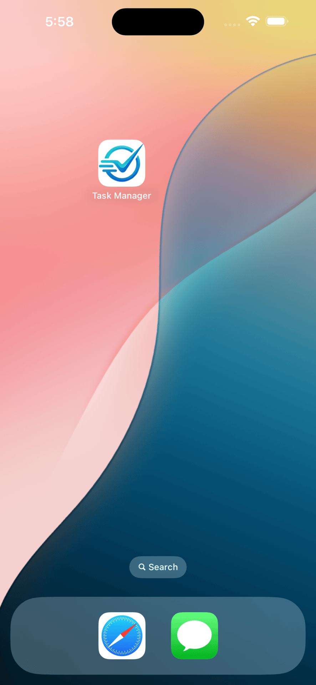

# Task Manager

A simple cross-platform Flutter application built as a technical assessment. It allows users to manage a daily task list, persisting them locally and communicating with a mock API on the first launch.

## Features
- View a list of tasks.
- Add new tasks (Title + Optional Description).
- Delete tasks.
- Mark tasks as complete or incomplete.
- Fetches initial seed data (5 items) from [JSONPlaceholder](https://jsonplaceholder.typicode.com/todos).
- State persists locally across app restarts.

## Demo

| App Demo |
|---|
|  |

## Screenshots

| App on Device Drawer | API Seed Data (First Launch) | Adding a New Task |
|---|---|---|
|  |  |  |

| Tasks Added | Tasks Marked Complete | Empty State | Network Error |
|---|---|---|---|
|  |  |  |  |

## How to Run the App

1. **Prerequisites:** Ensure you have the [Flutter SDK](https://flutter.dev/docs/get-started/install) installed (latest stable version).
2. **Clone the repository:**
   ```bash
   git clone <YOUR-REPOSITORY-URL>
   cd task_manager_flutter_bloc
   ```
3. **Install dependencies:**
   ```bash
   flutter pub get
   ```
4. **Generate Code** (Hive type adapters):
   ```bash
   dart run build_runner build --delete-conflicting-outputs
   ```
5. **Run the App:**
   - Run on an attached device or emulator:
     ```bash
     flutter run
     ```

## Architecture & State Management

**Architecture:** Clean Architecture
- **Domain Layer:** Pure Dart. Contains pure data entities (`Task`), abstract repository interfaces, and use cases.
- **Data Layer:** Contains API integration (`http`), local storage integration (`hive`), data models, and the repository implementation.
- **Presentation Layer:** Contains Flutter UI components and State Management.

**State Management: Bloc (`flutter_bloc`)**
- *Why Bloc?* Bloc offers a very strict and predictable separation of concerns. It enforces a unidirectional data flow (Events go in, States come out), making it highly testable and incredibly robust for clean architecture. It prevents UI files from carrying business logic, preventing unnecessary widget rebuilds.

**Local Storage: Hive**
- *Why Hive?* Hive is a lightweight, blazing-fast, and synchronous NoSQL database built entirely in Dart. It doesn't require native bindings like SQLite (preventing iOS/Android compilation friction) and takes zero boilerplate to store basic objects like Tasks.

## Known Limitations
1. **Mock API limitations:** The app relies on JSONPlaceholder for seed data. JSONPlaceholder does not actually save mutations on its server. Therefore, adding/deleting data is correctly mocked locally inside the device's persistent storage, but it doesn't propagate changes to a real upstream server infrastructure.
2. **iOS Signing:** Building the iOS target for a physical device requires injecting valid Apple provisioning profiles.

